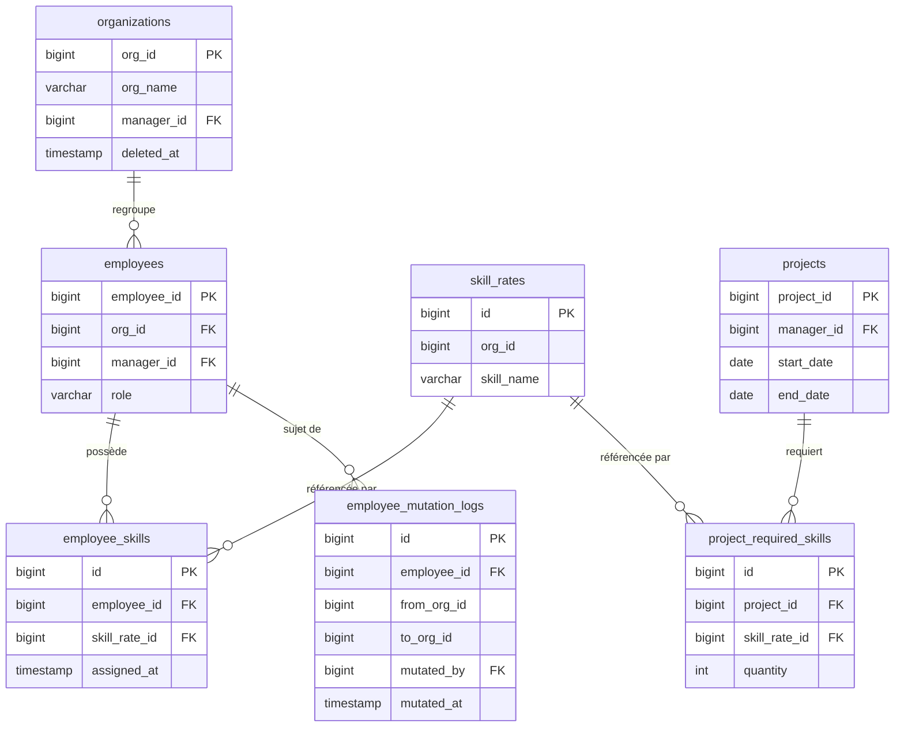

# Design Document — multi-org-employee-model

## Overview

Cette feature étend Timelyna pour supporter un modèle multi-organisation complet :
chaque organisation est une entité structurelle avec un manager responsable, les employés
portent des compétences, les projets déclarent des compétences requises, et un moteur de
suggestion associe automatiquement les employés disponibles et compétents aux projets.
Une mutation administrative permet de transférer un employé entre organisations avec
traçabilité complète.

L'extension est **additive** : aucune table existante n'est supprimée ou modifiée de façon
destructive. Les données existantes restent valides via une migration Alembic avec données
de seed.

---

## Architecture

```
┌─────────────────────────────────────────────────────────────────┐
│  Frontend (React + TypeScript)                                  │
│  AdminOrganizationsPage │ AdminUsersPage (mutation modal)       │
│  AdminProjectsPage (suggestions) │ EmployeeSkillsPanel          │
└────────────────────────┬────────────────────────────────────────┘
                         │ REST /api/v1/admin/...
┌────────────────────────▼────────────────────────────────────────┐
│  FastAPI Routers  (admin.py + organizations.py)                 │
└──────┬──────────────────────────────────────────────────────────┘
       │
┌──────▼──────────────────────────────────────────────────────────┐
│  Services                                                       │
│  OrganizationService │ MutationService │ EmployeeSuggestionSvc  │
└──────┬──────────────────────────────────────────────────────────┘
       │
┌──────▼──────────────────────────────────────────────────────────┐
│  Repositories                                                   │
│  OrganizationRepository │ EmployeeSkillRepository               │
│  ProjectSkillRepository │ MutationLogRepository                 │
└──────┬──────────────────────────────────────────────────────────┘
       │
┌──────▼──────────────────────────────────────────────────────────┐
│  PostgreSQL 15                                                  │
│  organizations │ employee_skills │ project_required_skills      │
│  employee_mutation_logs                                         │
└─────────────────────────────────────────────────────────────────┘
```

Le pattern existant **Repository → Service → Router** est conservé.
Les nouvelles routes sont ajoutées dans `backend/app/api/v1/admin.py` (organisations,
compétences employé, mutation) et dans un nouveau fichier `organizations.py` si le volume
le justifie. Les tâches email asynchrones passent par Celery.

---

## Components and Interfaces

### Nouvelles routes API

| Méthode | Route | Rôle requis | Description |
|---------|-------|-------------|-------------|
| GET | `/admin/organizations` | admin | Liste toutes les organisations actives |
| POST | `/admin/organizations` | admin | Crée une organisation |
| GET | `/admin/organizations/{id}` | admin | Détail d'une organisation |
| PUT | `/admin/organizations/{id}` | admin | Met à jour une organisation |
| DELETE | `/admin/organizations/{id}` | admin | Soft-delete |
| GET | `/admin/employees/{id}/skills` | admin | Compétences d'un employé |
| POST | `/admin/employees/{id}/skills` | admin | Ajoute une compétence |
| DELETE | `/admin/employees/{id}/skills/{skill_rate_id}` | admin | Retire une compétence |
| POST | `/admin/employees/{id}/mutate` | admin | Déclenche une mutation |
| GET | `/admin/employees/{id}/mutation-history` | admin | Historique des mutations |
| GET | `/admin/projects/{id}/suggested-employees` | admin, manager | Suggestions d'employés |
| POST | `/admin/projects` | admin | Création projet (étendu avec `required_skills`) |
| PUT | `/admin/projects/{id}` | admin | Mise à jour projet (étendu) |

### Schémas Pydantic (nouveaux)

```python
# Organizations
class CreateOrganizationRequest(BaseModel):
    org_name: str
    manager_id: int

class UpdateOrganizationRequest(BaseModel):
    org_name: str | None = None
    manager_id: int | None = None

class OrganizationResponse(BaseModel):
    org_id: int
    org_name: str
    manager_id: int
    employee_count: int
    created_at: str
    model_config = {"from_attributes": True}

# Employee Skills
class AddEmployeeSkillRequest(BaseModel):
    skill_rate_id: int

class EmployeeSkillResponse(BaseModel):
    id: int
    employee_id: int
    skill_rate_id: int
    skill_name: str
    assigned_at: str
    model_config = {"from_attributes": True}

# Mutation
class MutateEmployeeRequest(BaseModel):
    target_org_id: int
    reason: str | None = None  # max 500 chars

class MutationLogResponse(BaseModel):
    id: int
    employee_id: int
    from_org_id: int
    to_org_id: int
    mutated_by: int
    mutated_at: str
    reason: str | None
    model_config = {"from_attributes": True}

# Project skills (extension de CreateProjectRequest)
class ProjectSkillRequirement(BaseModel):
    skill_rate_id: int
    quantity: int = 1

# SuggestedEmployee
class SuggestedEmployeeResponse(BaseModel):
    employee_id: int
    full_name: str
    org_name: str
    matching_skills: list[str]
    matching_skill_count: int
    model_config = {"from_attributes": True}
```

### Services

**OrganizationService**
- `create_organization(org_name, manager_id) → Organization` — valide que le manager existe et a le rôle `manager` ou `admin`
- `update_organization(org_id, **kwargs) → Organization`
- `soft_delete(org_id) → None`
- `list_organizations() → list[Organization]`

**MutationService**
- `mutate_employee(employee_id, target_org_id, mutated_by, reason) → MutationLog`
  1. Vérifie que `target_org_id` est une organisation active
  2. Vérifie que l'employé n'est pas lui-même manager d'une organisation
  3. Met à jour `employees.org_id`
  4. Synchronise `employees.manager_id` avec `organizations.manager_id` de la nouvelle org
  5. Insère dans `employee_mutation_logs`
  6. Envoie un email asynchrone (Celery) au manager de la nouvelle organisation

**EmployeeSuggestionService**
- `suggest_employees(project_id) → list[SuggestedEmployee]`
  1. Charge les `project_required_skills` du projet
  2. Charge les employés ayant au moins une compétence requise via `employee_skills`
  3. Filtre : pas d'absence approuvée couvrant toute la période `[start_date, end_date]`
  4. Filtre : pas de chevauchement avec un autre projet actif sur la même période
  5. Trie par `matching_skill_count` décroissant

---

## Data Models

### Nouvelles tables

```sql
-- Table organizations
CREATE TABLE organizations (
    org_id      BIGINT PRIMARY KEY AUTOINCREMENT,
    org_name    VARCHAR(255) NOT NULL,
    manager_id  BIGINT NOT NULL REFERENCES employees(employee_id),
    created_at  TIMESTAMP WITH TIME ZONE DEFAULT now(),
    updated_at  TIMESTAMP WITH TIME ZONE DEFAULT now(),
    deleted_at  TIMESTAMP WITH TIME ZONE
);

-- Table employee_skills
CREATE TABLE employee_skills (
    id             BIGINT PRIMARY KEY AUTOINCREMENT,
    employee_id    BIGINT NOT NULL REFERENCES employees(employee_id),
    skill_rate_id  BIGINT NOT NULL REFERENCES skill_rates(id),
    assigned_at    TIMESTAMP WITH TIME ZONE DEFAULT now(),
    UNIQUE (employee_id, skill_rate_id)
);

-- Table project_required_skills
CREATE TABLE project_required_skills (
    id             BIGINT PRIMARY KEY AUTOINCREMENT,
    project_id     BIGINT NOT NULL REFERENCES projects(project_id),
    skill_rate_id  BIGINT NOT NULL REFERENCES skill_rates(id),
    quantity       INTEGER NOT NULL DEFAULT 1,
    UNIQUE (project_id, skill_rate_id)
);

-- Table employee_mutation_logs
CREATE TABLE employee_mutation_logs (
    id           BIGINT PRIMARY KEY AUTOINCREMENT,
    employee_id  BIGINT NOT NULL REFERENCES employees(employee_id),
    from_org_id  BIGINT NOT NULL,
    to_org_id    BIGINT NOT NULL,
    mutated_by   BIGINT NOT NULL REFERENCES employees(employee_id),
    mutated_at   TIMESTAMP WITH TIME ZONE DEFAULT now(),
    reason       VARCHAR(500)
);
```

### Modifications tables existantes

```sql
-- employees : org_id devient FK vers organizations
ALTER TABLE employees
    ADD CONSTRAINT fk_employees_org
    FOREIGN KEY (org_id) REFERENCES organizations(org_id);

-- org_settings : FK optionnelle vers organizations (rétrocompatibilité)
ALTER TABLE org_settings
    ADD COLUMN organizations_ref BIGINT REFERENCES organizations(org_id);
```

### Modèles SQLAlchemy (nouveaux fichiers)

- `backend/app/models/organization.py` — `Organization`
- `backend/app/models/employee_skill.py` — `EmployeeSkill`
- `backend/app/models/project_required_skill.py` — `ProjectRequiredSkill`
- `backend/app/models/employee_mutation_log.py` — `EmployeeMutationLog`

### Migration Alembic

Fichier : `backend/migrations/versions/0020_multi_org_employee_model.py`

Ordre d'exécution :
1. Créer `organizations`
2. Insérer la ligne par défaut (`org_id=1`, `org_name="Organisation par défaut"`, `manager_id=<premier admin>`)
3. Ajouter la FK `employees.org_id → organizations.org_id`
4. Créer `employee_skills`, `project_required_skills`, `employee_mutation_logs`
5. Ajouter la colonne optionnelle `org_settings.organizations_ref`

Le `downgrade()` supprime dans l'ordre inverse.

### Diagramme entité-relation (simplifié)



---

## Correctness Properties

*A property is a characteristic or behavior that should hold true across all valid executions of a system — essentially, a formal statement about what the system should do. Properties serve as the bridge between human-readable specifications and machine-verifiable correctness guarantees.*

### Property 1 : Organisation manager valide

*For any* organisation créée ou mise à jour, le `manager_id` référencé doit correspondre à un employé actif avec le rôle `manager` ou `admin`.

**Validates: Requirements 1.3, 1.6**

---

### Property 2 : Unicité compétence employé

*For any* paire `(employee_id, skill_rate_id)`, il ne peut exister qu'une seule ligne dans `employee_skills`.

**Validates: Requirements 3.3**

---

### Property 3 : Cohérence organisation compétence

*For any* compétence ajoutée à un employé, la `skill_rate_id` doit appartenir à la même organisation que l'employé (`skill_rates.org_id == employees.org_id`).

**Validates: Requirements 3.4**

---

### Property 4 : Mutation — round trip org_id

*For any* employé muté de l'organisation A vers l'organisation B, `employees.org_id` doit valoir B après la mutation, et un enregistrement dans `employee_mutation_logs` doit exister avec `from_org_id = A` et `to_org_id = B`.

**Validates: Requirements 6.1, 6.2**

---

### Property 5 : Mutation — synchronisation manager_id

*For any* mutation d'un employé vers une organisation cible, `employees.manager_id` doit être mis à jour avec `organizations.manager_id` de l'organisation cible.

**Validates: Requirements 6.6**

---

### Property 6 : Suggestions — compétences correspondantes

*For any* projet avec des compétences requises, tous les employés retournés par le moteur de suggestion doivent posséder au moins une des compétences requises via `employee_skills`.

**Validates: Requirements 4.3a**

---

### Property 7 : Suggestions — disponibilité (absence + chevauchement)

*For any* projet avec une période `[start_date, end_date]`, aucun employé retourné par le moteur de suggestion ne doit avoir une absence approuvée couvrant toute la période, ni un chevauchement actif avec un autre projet sur cette même période.

**Validates: Requirements 4.3b, 4.3c**

---

### Property 8 : Suggestions — tri décroissant

*For any* liste de suggestions retournée, le `matching_skill_count` de chaque élément doit être supérieur ou égal à celui de l'élément suivant (ordre décroissant).

**Validates: Requirements 4.4**

---

### Property 9 : Rétrocompatibilité migration

*For any* enregistrement `employees` existant avant migration, `org_id` doit valoir `1` après migration, et l'enregistrement `organizations` avec `org_id = 1` doit exister.

**Validates: Requirements 8.2, 8.3**

---

### Property 10 : Soft-delete organisation — employés conservés

*For any* organisation soft-deletée, les employés rattachés à cette organisation doivent toujours exister dans `employees` avec leur `org_id` inchangé.

**Validates: Requirements 1.7**

---

## Error Handling

| Situation | Code HTTP | Code erreur |
|-----------|-----------|-------------|
| `manager_id` invalide à la création/MAJ d'une organisation | 422 | `invalid_manager` |
| Employé sans organisation valide lors de la soumission d'un CRA | 422 | `no_valid_organization` |
| `org_id` cible d'une mutation inexistante ou soft-deletée | 422 | `invalid_target_organization` |
| Employé à muter est lui-même manager d'une organisation | 422 | `employee_is_org_manager` |
| Rôle employé invalide (hors `employee`, `manager`, `admin`, `finance`) | 422 | `invalid_role` |
| Email déjà utilisé lors d'une mise à jour | 422 | `email_already_exists` |
| Compétence d'une autre organisation ajoutée à un employé | 422 | `skill_org_mismatch` |
| Paire `(employee_id, skill_rate_id)` déjà existante | 409 | `skill_already_assigned` |

Toutes les erreurs suivent le format standardisé existant : `{ "detail": "...", "code": "..." }`.

---

## Testing Strategy

### Tests unitaires (pytest + httpx async)

Fichier : `backend/tests/test_multi_org.py`

Couvrent :
- Création d'organisation avec manager valide / invalide
- Ajout/suppression de compétence employé (unicité, cohérence org)
- Mutation : mise à jour `org_id`, `manager_id`, insertion log
- Mutation bloquée si l'employé est manager d'une org
- Suggestions : liste vide si aucun employé compétent
- Suggestions : exclusion des employés absents sur toute la période
- Rétrocompatibilité : `org_id = 1` après migration

### Tests property-based (Hypothesis)

Bibliothèque : **Hypothesis** (déjà dans l'écosystème Python, compatible pytest)
Configuration : `settings(max_examples=100)` minimum par propriété.

Chaque test est annoté :
```python
# Feature: multi-org-employee-model, Property N: <texte de la propriété>
```

| Property | Test Hypothesis |
|----------|----------------|
| P2 — Unicité compétence | Générer N paires aléatoires, vérifier qu'une insertion dupliquée lève une erreur |
| P4 — Mutation round trip | Générer employé + 2 orgs aléatoires, muter, vérifier `org_id` et log |
| P5 — Sync manager_id | Générer mutation, vérifier `manager_id` == `organizations.manager_id` cible |
| P6 — Suggestions compétences | Générer projet + pool d'employés avec compétences aléatoires, vérifier que tous les résultats ont ≥1 compétence requise |
| P7 — Suggestions disponibilité | Générer employés avec absences couvrant toute la période, vérifier qu'ils sont exclus |
| P8 — Tri décroissant | Générer résultats de suggestion, vérifier ordre `matching_skill_count` |
| P9 — Rétrocompatibilité | Vérifier que tous les employés existants ont `org_id = 1` après migration |
| P10 — Soft-delete org | Générer org + employés, soft-delete org, vérifier que les employés existent toujours |

### Tests d'intégration frontend

Fichier : `frontend/src/features/organizations/__tests__/`

- `AdminOrganizationsPage` : rendu, création, suppression (Vitest + React Testing Library)
- Mutation modal : sélection org cible, soumission, feedback erreur
- Suggestions : affichage liste avec compétences correspondantes
